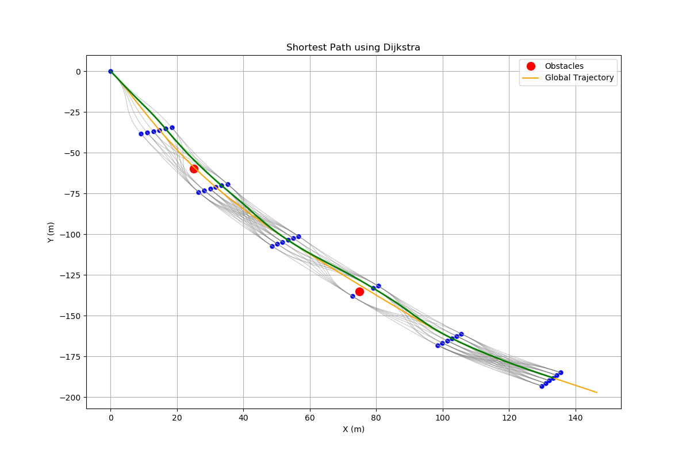

# Local-Obstacle-Avoidance-Trajectory-Generation-using-Dijkstra-Algorithm

## Motivation

[1] Kornev, Ivan & Kibalov, Vladislav & Shipitko, Oleg. (2020). Local Path Planning Algorithm for Autonomous Vehicle Based on Multi-objective Trajectory Optimization in State Lattice.

[2] M. Werling, J. Ziegler, S. Kammel and S. Thrun, "Optimal trajectory generation for dynamic street scenarios in a Frenét Frame," 2010 IEEE International Conference on Robotics and Automation, Anchorage, AK, USA, 2010, pp. 987-993, doi: 10.1109/ROBOT.2010.5509799.

## Overview
The graph search method from [1] is upgraded by incorporating the path generation technique outlined in [2]. This enhancement introduces jerk-minimizing edges in the graph, contrasting with the previous method's reliance on cubic polynomials without considering any optimality features.

Refer the Project_presentation.pdf and Project_Report.pdf files for detailed explanation of the algorithm developed. 


## Running the Code

```bash
$ cd path_to_folder/
$ python3 Djikstra_Planner.py
```

## Output

<!--        -->


## Demonstration of the code deployed on a Self-Driving SUV


<!--       -->
